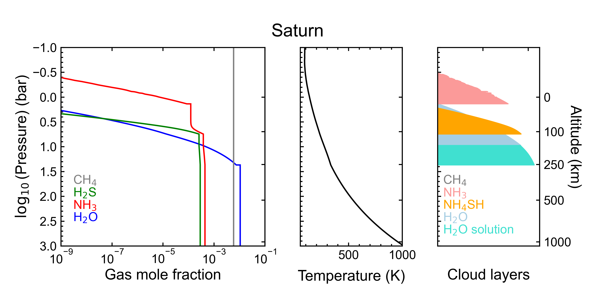

# ECCM - MRTM 

## ECCM 
ECCM is a simple equilibrium cloud condensation model relevant to computing the atmospheric composition and temperature profiles of giant planet tropospheres. 
It includes routines for computing profiles for water, ammonia, hydrogen sulfide, methane, and phosphine. 
Temperatures profiles are computed using either the dry adiabatic lapse rate or the wet adiabat when condensation occurs. 
Tropopause and stratosphere a priori profiles are included from radio occultation measurements. 

### Procedures 
- eccm - High-level interface 
- core - Core ECCM routines, written as loops accelerated with Numba 
- thermo_data - Vapor pressure and heat information for different gases 
- find_root - Scipy's Brent method implementation

## MRTM
MRTM is a simple non-scattering microwave radiative transfer model for computing microwave brightness temperatures from ECCM atmospheres. 
It includes models for the microwave opacity of ECCM gases developed by the Georgia Tech Planetary Atmospheres Lab. 

### Procedures 
- mrtm - Core MRTM routines, vectorized 
- molecule - Opacity models for gases 

  

